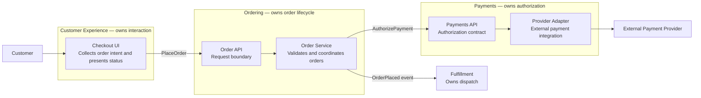
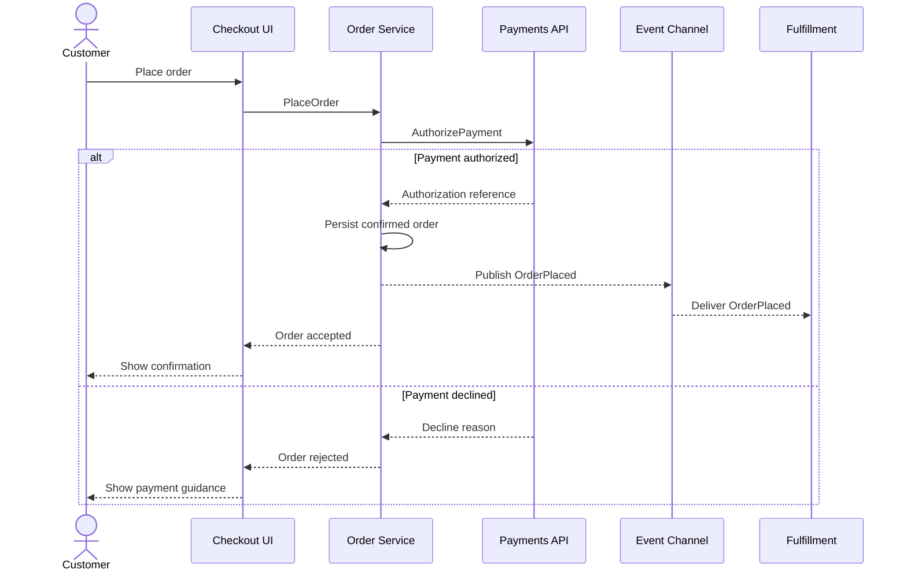
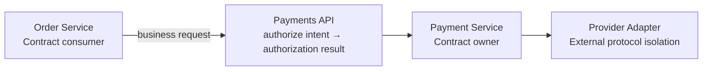
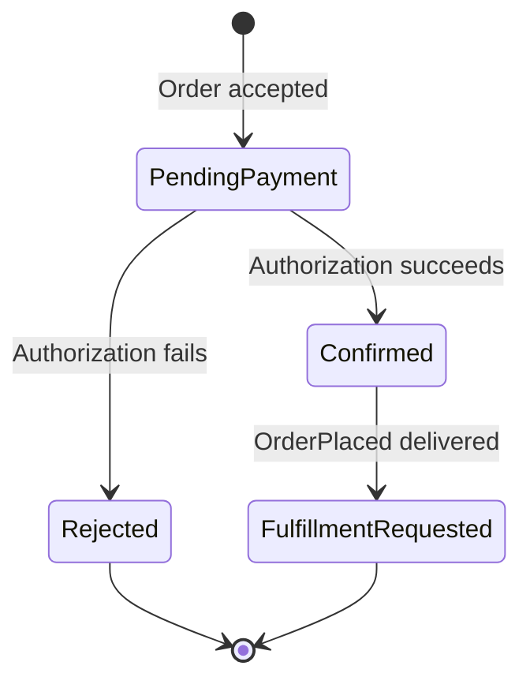

# Architecture Diagram Examples

These examples show complementary views of one small ordering system. Adapt their level and shape to the actual solution package; do not copy the example domain or create every view by default.

## Contents

- [Typical Diagram Set](#typical-diagram-set)
- [Subsystem, Component, and Ownership Map](#example-1-subsystem-component-and-ownership-map)
- [Business Use-Case Sequence](#example-2-business-use-case-sequence)
- [Focused Interface Boundary](#example-3-focused-interface-boundary)
- [Conditional Lifecycle View](#example-4-conditional-lifecycle-view)

## Typical Diagram Set

| Priority | View | Question answered | When to include |
|---|---|---|---|
| 1 | Subsystem/component ownership map | What exists, what does each part own, and where are the boundaries? | Default first view whenever visualization is requested |
| 2 | Business interaction sequence | How do the responsible parts collaborate for an important use case or data-flow spine? | When the behavior crosses owners or its interaction order matters |
| 3 | Focused interface or event boundary | What contract connects two owners? | Only when the contract itself needs clarification beyond labels in the first two views |
| 4 | State, data, deployment, or local-flow view | What additional structure governs this particular design? | Only when the solution depends materially on it or the user asks for it |

## Example 1: Subsystem, Component, and Ownership Map

This is the normal starting point. Subgraphs establish subsystem ownership, nodes state component responsibility, and edge labels name important contracts.

The diagram deliberately omits classes, database tables, and helper calls. Its purpose is to make responsibilities, ownership, and major dependencies legible.

## Example 2: Business Use-Case Sequence

This view follows one primary data-flow spine across the owners from the first diagram. Messages name business interactions and contracts rather than every internal call.

Create another sequence only when another use case has a materially different spine. Do not make one sequence per acceptance criterion when the interaction shape is the same.

## Example 3: Focused Interface Boundary

Most interfaces should remain labels in the structural and sequence views. Use a focused diagram only when the boundary itself is architecturally important.

The reading notes should identify the contract owner, semantic input and outcome, and the dependency direction. Avoid expanding the diagram into method signatures or payload fields unless those details define the architectural boundary.

## Example 4: Conditional Lifecycle View

Add a state diagram only when lifecycle rules materially affect the design. It complements rather than replaces the ownership and sequence views.

Data/entity, deployment/runtime, and bounded-local-flow diagrams follow the same rule: include them only when they answer an important question that the structural and sequence views do not already answer.
